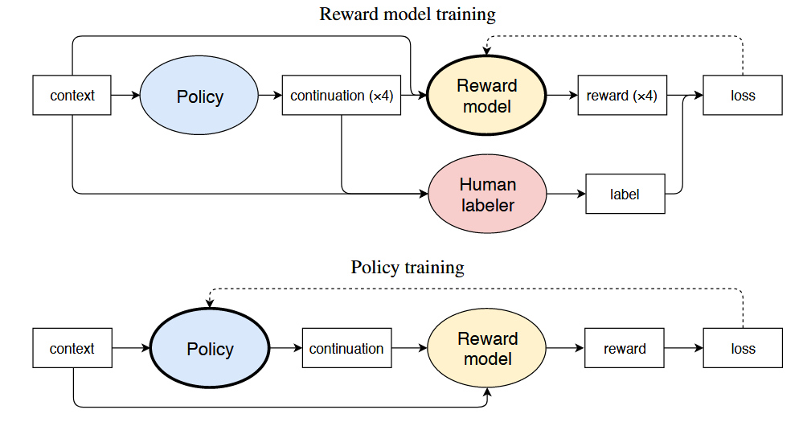

#### 一、动机 (Motivation)

##### 1. 背景

*   Reward Learning(奖励学习)使强化学习能够应用于由人类判断定义奖励的任务，通过向人类提问建立奖励模型
*   大多数关于奖励学习的工作都使用了模拟环境，但关于真实世界的复杂信息通常用自然语言表达，本文认为语言的奖励学习是使RL在现实世界任务中实用和安全的关键
*   当Agent必须与人类进行通信以帮助提供更准确的监督信号时，自然语言尤为重要
*   对于NLP任务，有监督数据集很难获取或数据量很少
*   基于程序设计的奖励函数一般效果很差，难以实现准确的目标

##### 2. 相关工作

之前也有很多方法将强化学习应用于自然语言任务：

*   用于翻译的BLEU
*   用于摘要的ROUGE
*   ... ...

##### 3. 本文方案

将自然语言处理中的pretraining advances与human preference learning结合起来，使用强化学习而不是监督学习来fine-tune pretrained language模型，并使用KL散度来进行约束防止微调后的模型偏离预训练的模型太远

本文在语言模型生成预训练的基础上，将奖励学习应用于两种自然语言任务：

*   进行文本续写
*   进行文本摘要总结

#### 二、框架（Framework）

##### 1. 设定

本项工作中的vocabulary为$\sum$，预训练好的语言模型为$\rho$，初始化需要微调的策略$\pi=\rho$，并使用强化学习去对其进行微调。

$$
\rho(x_0 … x_{n-1}) = \prod_{0 <= k < n} \rho(x_k | x_0 … x_{k-1})
$$

在本项工作中设定输入空间为$X=\sum^{<=m}$，且X服从数据分布D；设定输出空间为$Y=\sum^n$。例如$x\in X$可以是一篇不超过1000字的文章，而$y \in Y$可以是该文章的100字总结。在此基础上，定义奖励函数为$\tau:X\times Y\rightarrow \mathcal{R}$，这意味着我们对于一个输入$x$和一个根据$x$得到的输出$y$只给出一个整体的reward，而不是每生成一个token去进行一次奖励。奖励的期望为：

$$
\mathbb{E}_\pi \left[ r \right] = \mathbb{E}_{x \sim \mathcal{D}, y \sim \pi(\cdot | x)} \left[ r(x, y) \right]

$$

为了实现使用人工标签来训练奖励函数并对其进行优化的目标，对于每个输入$x$我们将其输入到语言模型中得到4个输出$(y_0,y_1,y_2,y_3)$，然后让标签者选出它们认为最好的一个输出，并记录为$b\in \{ 0,1,2,3\}$，得到对奖励模型进行训练的数据集$S$为$(x,y_0,y_1,y_2,y_3,b)$，并使用以下**softmax cross entropy**对奖励模型进行训练：

$$
\text{loss}(r) = \mathbb{E}_{(x, \{y_i\}_i, b) \sim \mathcal{S}} \left[ \log \frac{e^{r(x, y_b)}}{\sum_i e^{r(x, y_i)}} \right]

$$

##### 2. reward R function

这节介绍的是使用怎样的奖励函数来计算执行每个action后得到的优势函数，以此来进行PPO算法。

为了使策略模型$\pi$在优化生成目标时，依然保持与初始模型$\rho$的相似性，避免生成过于极端或不自然的句子，我们加入一个KL散度项来对奖励函数进行约束，进行修改后的奖励函数为：

$$
R(x, y) = r(x, y) - \beta \log \frac{\pi(y | x)}{\rho(y | x)}

$$

其中$x$表示为输入的prompt，$y$表示生成的response，它是一个整体的reward，是对于整体的prompt和response的reward。

##### 3. 计算state value

需要注意的是，在此工作中，每生成一个token（即执行动作a）就将其与前面的已生成文本（即在执行该动作时的状态s）拼接起来，作为下一个执行动作的状态state，因此状态空间是无限的。在此工作中，critic model采用的是一个GPT结构的模型，模型接收prompt+response作为输入，response中每个token位置上都输出一个标量value，也就是当前token作为结尾的state的v值。因为GPT模型的attention-mask机制，每个token对应的value只和自己的上文有关，也就是只和当前状态有关，不涉及下一状态，所以可以一次计算出所有状态的v值。

在有了v值和reward之后，我们就可以采用PPO算法对策略模型$\pi$和critic model进行更新

##### 4. 计算GAE

在生成一个response结束之后，首先将该prompt+response输入到reward model中计算出$r(prompt, response)$；然后将该prompt+response输入到critic model中，计算出每个token作为结尾时的v值，计算每个$(s,a)$对对应的优势函数：

$$
A(s,a)=R(x,y)-V(s)
$$

计算出每个token对应的优势函数后，采用PPO-CLIP对策略模型$\pi$进行更新

##### 5. 对critic model进行更新

使用MSE损失计算$R(x,y)$与$V_t$之间的差距，对critic model进行更新

##### 6. 举例说明

*   场景：假设输入文本$x$为”今天公司举办了一个团队合作的培训活动，”，其作为初始状态$s_0$，生成过程如下：

    *   假设策略模型在状态$s_0$下生成了第一个$BPE  token  y_1$：”今天”，新的状态$s_1$就变成了”今天公司举办了一个团队合作的培训活动，今天”

    *   在状态$s_1$下策略模型生成下一个$token  y_2$：”活动”，新的状态$s_2$就变成了”今天公司举办了一个团队合作的培训活动，今天活动”

    *   在状态$s_2$下策略模型生成下一个$token  y_3$：”非常”，新的状态$s_3$就变成了”今天公司举办了一个团队合作的培训活动，今天活动非常”

    *   在状态$s_3$下策略模型生成下一个$token  y_4$：”有意义”，新的状态$s_4$就变成了”今天公司举办了一个团队合作的培训活动，今天活动非常有意义”

    *   在状态$s_4$下策略模型生成下一个$token  y_5$：”$\EOS$”，表示这句话生成结束，该episode已完成，末状态$s_5$为”今天公司举办了一个团队合作的培训活动，今天活动非常有意义$\EOS$”

*   共进行4次这样的过程，生成4个对应输出，将这4个输出+输入文本$x$一起输入到策略模型$\pi$和原始模型$\rho$中，得到对应的输出概率

    *   $y_0$

        \=”今天活动非常有意义” ——$\pi$：0.60，$\rho$：0.30

    *   $y_1$

        \=”但是活动过于漫长” ——$\pi$：0.10，$\rho$：0.25

    *   $y_2$

        \=”大家都没有什么收获” ——$\pi$：0.15，$\rho$：0.20

    *   $y_3$

        \=”整个过程平平无奇” ——$\pi$：0.15，$\rho$：0.25

    则根据$R(x,y)$计算公式，计算出每个$(x,y)$对对应的奖励

*   以$y_0$为例，将$x+y_0$输入到critic model中，计算出每个子状态对应的V值

    *   $V(s_0)$

        \=$V("今天公司举办了一个团队合作的培训活动，")$

    *   $V(s_1)$

        \=$V("今天公司举办了一个团队合作的培训活动，今天")$

    *   $V(s_2)$

        \=$V("今天公司举办了一个团队合作的培训活动，今天活动")$

    *   $V(s_3)$

        \=$V("今天公司举办了一个团队合作的培训活动，今天活动非常")$

    *   $V(s_4)$

        \=$V("今天公司举办了一个团队合作的培训活动，今天活动非常有意义")$

    *   $V(s_5)$

        \=$V("今天公司举办了一个团队合作的培训活动，今天活动非常有意义\EOS")$

*   计算每个$(s,a)$对对应的优势函数$A(s,a)$

    *   $A(s_0, a_0)=A(“今天公司举办了一个团队合作的培训活动，“,”今天”)$                 $=R("今天公司举办了一个团队合作的培训活动，","今天活动非常有意义\EOS")-V("今天公司举办了一个团队合作的培训活动，")$

    *   $A(s_1, a_1)=A(“今天公司举办了一个团队合作的培训活动，今天“,”活动”)$                 $=R("今天公司举办了一个团队合作的培训活动，","今天活动非常有意义\EOS")-V("今天公司举办了一个团队合作的培训活动，今天")$

    *   $A(s_2, a_2)=A(“今天公司举办了一个团队合作的培训活动，今天活动“,”非常”)$                 $=R("今天公司举办了一个团队合作的培训活动，","今天活动非常有意义\EOS")-V("今天公司举办了一个团队合作的培训活动，今天活动")$

    *   $A(s_3, a_3)=A(“今天公司举办了一个团队合作的培训活动，今天活动非常","有意义")$                 $=R("今天公司举办了一个团队合作的培训活动，","今天活动非常有意义\EOS")-V("今天公司举办了一个团队合作的培训活动，今天活动非常")$

    *   $A(s_4, a_4)=A(“今天公司举办了一个团队合作的培训活动，今天活动非常有意义","\EOS")$                $=R(“今天公司举办了一个团队合作的培训活动，“,”今天活动非常有意义\EOS”)-V(“今天公司举办了一个团队合作的培训活动，今天活动非常有意义“)$

*   根据计算出来的优势函数，使用PPO-CLIP算法对策略模型$\pi$进行更新

*   对critic model进行更新$$
    loss=\sum_s{{(R(x,y)-V(s))}^2}
    $$
